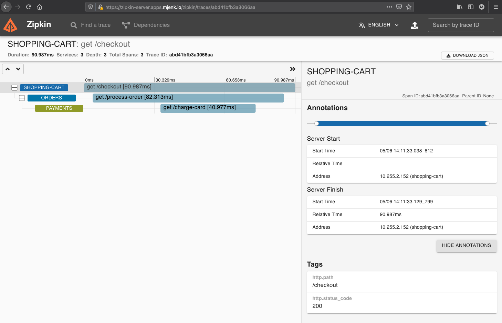

# PCF Zipkin Tracing Express/NodeJS Sample App

This is a nodejs repository with three apps: 
- shopping-cart
- orders
- payments.

These apps use [Zipkin](https://github.com/openzipkin/zipkin-js) to trace the calls between them. 

The traces can then be viewed using tools such as PCF AppMetrics, Zipkin Server, and Splunk.

## Prerequisites - Zipkin Server
To demo this application, a **Zipkin Server** is required and must be running to forward spans traced by the apps

The following link contains the steps necessary to download the Zipkin Server JAR: https://github.com/openzipkin/zipkin#quick-start

First, download the JAR using the quick-start guide (NOTE: You can also view the releases [here at this link](https://search.maven.org/remote_content?g=io.zipkin&a=zipkin-server&v=LATEST&c=exec):
```
curl -sSL https://zipkin.io/quickstart.sh | bash -s
```

Next, push the JAR to PCF to deploy the zipkin-server:
```
cf push zipkin-server -p zipkin.jar
```

Validate that the zipkin server was deployed successfully:
```
cf app zipkin-server                                 
Showing health and status for app zipkin-server in org dev / space dev as admin...

name:              zipkin-server
requested state:   started
routes:            zipkin-server.apps.mjenk.io
last uploaded:     Wed 05 May 10:16:21 CDT 2021
stack:             cflinuxfs3
buildpacks:        
        name                     version                                                                     detect output   buildpack name
        java_buildpack_offline   v4.36-offline-https://github.com/cloudfoundry/java-buildpack.git#ebf9f057   java            java
type:           web
sidecars:       
instances:      1/1
memory usage:   1024M
     state     since                  cpu    memory         disk           details
#0   running   2021-05-05T15:17:08Z   0.2%   312.7M of 1G   172.2M of 1G
```

Once the zipkin-server has been successfully deployed, proceed to the next section.

## Using the sample apps

### 1) UPDATE DEPLOYMENT MANIFEST
Prior to deploying the sample apps, first update the deployment `manifest.yml` with your environment's specific configuration for the following values:
```yaml
  ...
  env:
    ZIPKIN_SERVER_HOST: zipkin-server.apps.mjenk.io
    PAYMENTS_HOST: payments.apps.mjenk.io
    ORDERS_HOST: orders.apps.mjenk.io
```

You may also update other values within the deployment manifest as needed

### DEPLOY
To deploy, you must login as a user that has the ability to assign space permissions and make spaces.
It will create a given shopping-cart, orders, and payments app that can be used to preview an example trace.

To deploy, run:
```
cf push
```

### TEST APPS
The call flow for this application is:
  - shopping-cart -----> orders -----> payments

#### Step 1) 
In your browser, navigate to `/checkout` or curl the `/checkout` endpoint for the given Shopping Cart app.

You should receive a 200 OK message that says `card successfully charged!`

#### Step 2)
After hitting the `/checkout` endpoint, navigate to the zipkin-server UI using the Route that was created when you pushed the zipkin-server app


### VISUALIZE TRACES & DEPENDENCIES
Below depicts an example of the shopping-cart trace in the Zipkin Server UI:




### CLEANUP

To cleanup, run:
```
cf delete payments -f -r
cf delete orders -f -r
cf delete shopping-cart -f -r
```